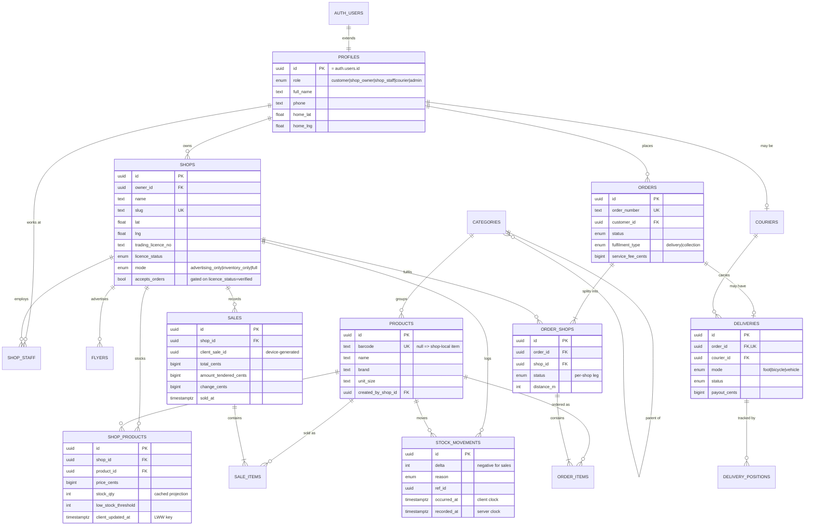

# SmartKasi — Data Model

Source of truth: [`db/schema.sql`](../db/schema.sql), mirrored into [`apps/api/prisma/schema.prisma`](../apps/api/prisma/schema.prisma). This document explains *why*
the tables look the way they do. If the two disagree, the SQL wins.

---

## Entity relationship diagram

---

## The five decisions that matter

### 1. One global `products` table, keyed on barcode

The price-comparison feature — *"Tuckshop A · 500 m · R18 / Tuckshop B · 600 m · R21"* —
only works if two different shops scanning the same tin of pilchards resolve to
the **same product row**. The obvious modelling instinct (each shop owns its own
product list) makes that feature impossible to build later without a painful
migration and a fuzzy-matching job.

So: `products` is global, `barcode` is unique, and `shop_products` is the join
that carries price and stock.

Shops can still create their own items — kotas, loose sweets, anything without a
barcode. Those rows get `created_by_shop_id` set and `barcode = null`, and are
deliberately excluded from `v_product_offers`, because a shop's homemade kota is
not comparable to another shop's homemade kota.

### 2. Stock is a ledger, not a counter

`stock_movements` is append-only. `shop_products.stock_qty` is a cached
projection maintained by a trigger.

This exists because of offline POS. A till that has been offline since Thursday
will flush 60 sales at once on Saturday. If stock were a bare counter you would
have to reason about ordering, lost updates, and whether a replay double-decrements.
With a ledger, replay safety reduces to *"did I already insert this movement?"* —
which the idempotency key answers.

It also means "why is my stock wrong?" is a query, not a mystery.

### 3. `client_sale_id` is the entire offline story on the server

The device generates a UUID at the moment of sale and keeps it forever.
`unique (shop_id, client_sale_id)` means the same batch posted five times
produces one sale.

**The backend has no sync logic.** It has an idempotent write endpoint and a
delta-read endpoint. Everything else about offline is a client concern — the
Flutter app's local queue. This is the single biggest scope saving available on
this project, and it is why the deadline is survivable.

### 4. Orders split into per-shop legs

A basket spanning three spazas is one `orders` row and three `order_shops` rows.
Each shop accepts or rejects only its own leg. That is why `orders.status` has
`partially_accepted` — the realistic outcome, not an edge case.

Modelling this as one order per shop would break the shared service fee, which
is calculated across the whole basket.

### 5. No PostGIS — coordinates are plain doubles

`shops.lat` / `shops.lng` are `double precision`, not `geography(Point, 4326)`.

This is forced by the stack choice, not preferred: Prisma has no support for
the `geography` type. It introspects as `Unsupported(...)` and those columns
cannot be read through the typed client at all — so a PostGIS schema would mean
raw SQL for exactly the queries that matter most (shop search, price comparison)
while still paying the codegen tax everywhere else.

The pattern that replaces it: a bounding-box filter in Postgres, which does use
the `(lat, lng)` index, then an exact haversine pass in `common/geo.ts`. The box
over-selects the corners of the square, so the haversine pass is what makes the
radius a real circle — it is what correctly drops a shop 3085 m away from a 3 km
search.

**What this costs.** No GIST index, and the two geo queries page in memory. At
tens or hundreds of shops that is free. Past a few thousand shops, add PostGIS
back and move `shops.list` and `search.products` to raw SQL. Nothing else in the
schema has to change — that is why the columns are named plainly.

### 6. Courier position is a separate table with no customer-facing path

`delivery_positions` is internal. No endpoint returns it to a customer, and no
RLS policy grants a customer access.

This is not a privacy nicety. A customer app that renders a courier's live route
through a township publishes, in advance, where a person carrying cash and goods
will be. The constraint is enforced in three places — the table comment, the RLS
policies, and the response schemas in `openapi.yaml` — because it is exactly the
kind of thing someone adds "just for the demo" on Sunday morning.

Customers get: status enum + a coarse ETA band. Nothing else.

---

## What's deliberately missing from v1

| Not modelled | Why |
|---|---|
| Payments / Yoco ledger | Marked N/A. Cash on delivery only in v1. |
| Ratings & reviews | No trust problem to solve at demo scale. |
| Promotions / discount rules | `sales.discount_cents` is a free-form amount; no rule engine. |
| Multi-currency | ZAR cents everywhere. |
| Product images pipeline | R2 URL string only; no resize/CDN variants. |
| AI dish→ingredients cache | Endpoint is a stub; no persistence yet. |
